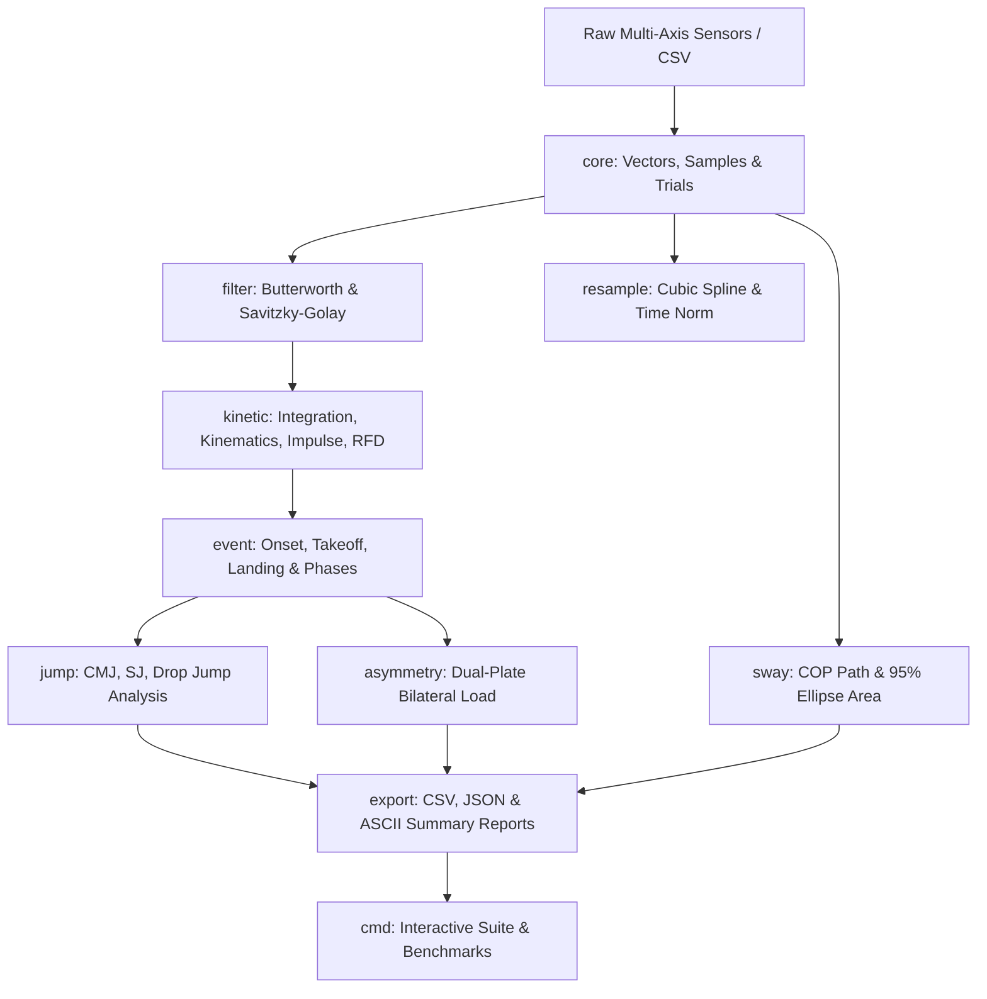

# moonbit-forceplate (MoonBit 测力台分析库)

> A high-performance, pure MoonBit library for force plate signal processing, kinematics integration, automated jump event detection, posturography sway analysis, and dual-plate bilateral asymmetry evaluation.

[](https://github.com/hnriiuu/moonbit-forceplate/actions/workflows/test.yml)
[](LICENSE)
[](https://www.moonbitlang.com/)

---

## 📖 Overview

`moonbit-forceplate` is a sports science and biomechanics analysis engine developed in [MoonBit](https://www.moonbitlang.com). It provides end-to-end processing pipelines for multi-axis force plate sensors, enabling real-time and offline analysis of athletic performance, neuromuscular readiness, balance posturography, and injury rehabilitation metrics.

### Key Capabilities
- **Multi-Axis Signal Calibration & Tare**: Taring baseline offsets, gain scaling, 3D force vectors ($\vec{F} = [F_x, F_y, F_z]^T$), moments ($\vec{M} = [M_x, M_y, M_z]^T$), and Center of Pressure (COP) calculation.
- **DSP Filtering & Resampling**: 2nd/4th-order Butterworth lowpass/highpass/bandpass IIR filters with zero-phase forward-backward filtering (`filtfilt`), Savitzky-Golay polynomial smoothing, moving average, and natural cubic spline resampling.
- **Kinetic Integration & RFD**: Body mass estimation from quiet standing baseline, net force calculation, double integration for velocity and displacement, impulse breakdown (braking vs. propulsive), and windowed Rate of Force Development (RFD 0–50ms, 0–100ms, 0–150ms, 0–200ms).
- **Automated Event & Phase Detection**: $5\sigma$ movement onset detection, minimum force dip, takeoff ($<10\text{ N}$), landing impact ($>10\text{ N}$), and 6-phase movement partitioning.
- **Jump Protocols**:
  - **Countermovement Jump (CMJ)**: Jump height (flight time vs. impulse-momentum), modified RSI ($\text{RSI}_{mod}$), peak force, peak power, time to takeoff.
  - **Squat Jump (SJ)**: Concentric phase duration, peak power, countermovement dip warning detection.
  - **Drop Jump / Depth Jump (DJ)**: Ground contact time ($t_{contact}$), Reactive Strength Index ($\text{RSI} = t_{flight} / t_{contact}$), initial landing impact peak, dynamic leg stiffness ($K_{leg}$).
- **Static Balance & Posturography**: COP total path length, mean velocity, anteroposterior (AP) and mediolateral (ML) sway ranges, 95% Confidence Ellipse Area via covariance matrix eigenvalue decomposition.
- **Bilateral Dual-Plate Asymmetry**: Left vs. Right load distribution percentage, Symmetry Index (SI), Asymmetry Ratio (AR), Absolute Percentage Difference (APD), phase-specific peak force asymmetry.
- **Reporting & Exporters**: CSV export/import, JSON serialization, and publication-ready ASCII biomechanics report generation with sparkline force-time curves.

---

## 📐 Mathematical & Biomechanical Formulations

### 1. Kinematics from Vertical Ground Reaction Force (vGRF)
Body mass $m$ is estimated from quiet standing vertical force $F_{z,quiet}$:
$$m = \frac{1}{g \cdot N} \sum_{i=1}^N F_{z,quiet}[i]$$

Net force $F_{net}(t)$, acceleration $a(t)$, velocity $v(t)$, and displacement $s(t)$:
$$F_{net}(t) = F_z(t) - m g$$
$$a(t) = \frac{F_{net}(t)}{m}$$
$$v(t) = v(0) + \int_{0}^t a(\tau) d\tau$$
$$s(t) = s(0) + \int_{0}^t v(\tau) d\tau$$

### 2. Jump Height Calculation Methods
- **Flight Time Method**:
  $$h_{flight} = \frac{1}{2} g \left( \frac{t_{flight}}{2} \right)^2 = \frac{g \cdot t_{flight}^2}{8}$$
- **Impulse-Momentum Method**:
  $$v_{takeoff} = \frac{1}{m} \int_{t_{onset}}^{t_{takeoff}} F_{net}(t) dt$$
  $$h_{impulse} = \frac{v_{takeoff}^2}{2g}$$

### 3. Modified Reactive Strength Index ($\text{RSI}_{mod}$)
$$\text{RSI}_{mod} = \frac{\text{Jump Height (m)}}{\text{Time to Takeoff (s)}}$$

### 4. 95% Confidence Ellipse Area (Posturography COP Sway)
Given COP coordinates $(x_i, y_i)$, the $2 \times 2$ covariance matrix $C$ is computed:
$$C = \begin{bmatrix} s_{xx} & s_{xy} \\ s_{xy} & s_{yy} \end{bmatrix}$$
The eigenvalues $\lambda_1, \lambda_2$ are extracted via characteristic polynomial solution. The 95% confidence ellipse area ($p = 0.05, \chi^2_{2, 0.05} = 5.99146$) is:
$$\text{Area}_{95\%} = 5.99146 \cdot \pi \cdot \sqrt{\lambda_1 \lambda_2}$$

### 5. Bilateral Symmetry Index ($\text{SI}$)
$$\text{SI} = \frac{X_{Left} - X_{Right}}{\frac{1}{2} (X_{Left} + X_{Right})} \times 100\%$$

---

## 🏗️ Architecture & Package Layout



### Package Summary

| Package | Path | Description |
| :--- | :--- | :--- |
| `core` | [`core/`](file:///d:/何南瑞初审2/core) | 3D vector math (`Vec3`), `CoPPoint`, `ForceSample`, `CalibrationParams`, `ForceTrial` buffers |
| `filter` | [`filter/`](file:///d:/何南瑞初审2/filter) | Butterworth lowpass/highpass/bandpass, zero-phase `filtfilt`, Savitzky-Golay smoothing |
| `resample` | [`resample/`](file:///d:/何南瑞初审2/resample) | Natural cubic spline interpolation, frequency resampling (e.g., 1000 Hz), 0-100% time normalization |
| `kinetic` | [`kinetic/`](file:///d:/何南瑞初审2/kinetic) | Numerical integration (Trapezoidal, Simpson's), kinematics derivation, impulse, windowed RFD |
| `event` | [`event/`](file:///d:/何南瑞初审2/event) | Movement onset ($5\sigma$), takeoff, landing detection, 6-phase temporal segmentation |
| `jump` | [`jump/`](file:///d:/何南瑞初审2/jump) | Countermovement Jump (CMJ), Squat Jump (SJ), and Drop Jump (DJ) analysis protocols |
| `sway` | [`sway/`](file:///d:/何南瑞初审2/sway) | Center of Pressure path length, mean velocity, AP/ML ranges, 95% confidence ellipse area |
| `asymmetry` | [`asymmetry/`](file:///d:/何南瑞初审2/asymmetry) | Bilateral dual-plate load distribution percentage, Symmetry Index (SI), phase peak force asymmetry |
| `export` | [`export/`](file:///d:/何南瑞初审2/export) | CSV log exporter/parser, JSON serialization, ASCII sparkline visual report generator |
| `cmd` | [`cmd/`](file:///d:/何南瑞初审2/cmd) | Interactive CLI application (`moon run cmd/main`), synthetic dataset generators, benchmarks |

---

## 💻 Quick Start & Usage Examples

### 1. Countermovement Jump (CMJ) Analysis

```moonbit
let meta = @core.TrialMetadata::new("Athlete_01", 1000.0, 75.0, "both")
let raw_trial = @cmd.generate_synthetic_cmj_trial("Athlete_01", 75.0, 1000.0)

// Apply zero-phase Butterworth lowpass filter (10 Hz cutoff)
let filtered_trial = @filter.filter_trial_forces(raw_trial, 10.0, true)

// Analyze CMJ performance
let cmj_report = @jump.analyze_cmj_trial(filtered_trial, 75.0)

println("Jump Height (Flight Time): " + (cmj_report.jump_height_flight_m * 100.0).to_string() + " cm")
println("Modified RSI (m/s): " + cmj_report.rsi_modified.to_string())
println("Peak Force: " + cmj_report.peak_force_n.to_string() + " N")
```

### 2. Static Balance Posturography (COP Sway)

```moonbit
let sway_trial = @cmd.generate_synthetic_sway_trial("Patient_02", 10.0, 100.0)
let sway_report = @sway.analyze_sway_trial(sway_trial)

println("Total COP Path Length: " + sway_report.total_path_length_mm.to_string() + " mm")
println("Mean COP Velocity: " + sway_report.mean_velocity_mm_s.to_string() + " mm/s")
println("95% Ellipse Area: " + sway_report.ellipse_95_area_mm2.to_string() + " mm^2")
```

### 3. ASCII Report Generation

```moonbit
let rpt = @export.format_cmj_ascii_report(filtered_trial, cmj_report)
println(rpt)
```

Sample ASCII Output:
```text
======================================================================
            MOONBIT FORCE PLATE BIOMECHANICS REPORT (CMJ)             
======================================================================
Subject ID      : Athlete_PRO_01
Sampling Rate   : 1000 Hz
Body Mass       : 75 kg
----------------------------------------------------------------------
FORCE-TIME CURVE: [▃▃▃▃▃▃▃▃▃▃▃▃▃▂▂▂ ▂▃▄▅▆▂          ▃▇█▆▅▄▄]
----------------------------------------------------------------------
JUMP PERFORMANCE METRICS:
  Jump Height (Flight Time)  : 19.71 cm
  Jump Height (Impulse)      : 19.58 cm
  RSI-Modified (m/s)         : 0.284
  Takeoff Velocity (m/s)     : 1.96 m/s
  Peak Force (N)             : 1816.33 N (2.47 BW)
  Peak Power (W)             : 2434.50 W (32.46 W/kg)
----------------------------------------------------------------------
PHASE TIMINGS (s):
  Eccentric/Braking Phase    : 0.210 s
  Concentric/Propulsive Phase: 0.235 s
  Time to Takeoff            : 0.695 s
======================================================================
```

---

## 🛠️ Verification & Quality Assurance

This repository adheres strictly to MoonBit toolchain quality standards:

```bash
# Typecheck all packages
moon check

# Execute complete unit & integration test suite (36 tests)
moon test

# Code formatting compliance
moon fmt

# Package interface signatures check
moon info

# Run interactive CLI application
moon run cmd/main
```

---

## 📄 License

This project is licensed under the **Apache License 2.0**. See the [LICENSE](LICENSE) file for details.
